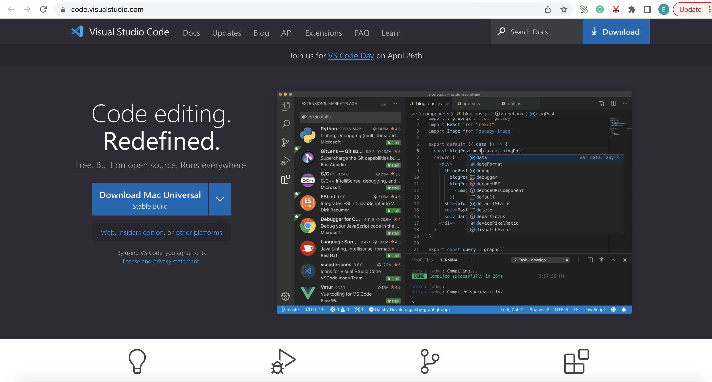

# Lab Report 1

## Installing VScode

* I already had VScode downloaded onto my computer, so I didn't do this step exactly.
* However, if a student did not yet have Visual Studio Code downloaded, the steps would be:
1. Go to the Visual Studio Code website [https://code.visualstudio.com/](https://code.visualstudio.com/). 
2. Follow the instructions to download and install VSCode. 
3. Once VSCode is installed, the student shouldd be able to open a window that is similar to the one below.
 
