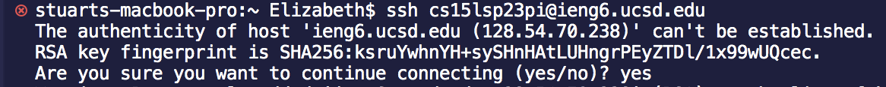

# Lab Report 1

## Installing VScode
* I already had VScode downloaded onto my computer, so I didn't do this step exactly.
* However, if a student did not yet have Visual Studio Code downloaded, the steps would be:
1. Go to the Visual Studio Code website [https://code.visualstudio.com/](https://code.visualstudio.com/). 
2. Follow the instructions to download and install VScode. 
3. Once VScode is installed, the student should be able to open a window that looks like the one below by clicking on the VScode application on their computer.  

## Remotely Connecting 
* First I looked up my course-specific account for CSE15L at [https://sdacs.ucsd.edu/~icc/index.php](https://sdacs.ucsd.edu/~icc/index.php).
* Then I followed the instructions at [https://drive.google.com/file/d/17IDZn8Qq7Q0RkYMxdiIR0o6HJ3B5YqSW/view](https://drive.google.com/file/d/17IDZn8Qq7Q0RkYMxdiIR0o6HJ3B5YqSW/view) to reset my password.
* I opened a terminal in VScode by going to **Terminal** and then **New Terminal**. 
* Then to use **ssh**, I typed the command `$ ssh cs15lsp23pi@ieng6.ucsd.edu` 
* Since this was my first time connecting onto this server, I got this message: 
* I typed `yes`, pressed enter, and typed in my password. This was the resulting code on the remote server: 
* Now my terminal has successfully connected to the remote server.

## Trying Some Commands
* I used the `ls -lat` command. `ls` is used to list the files and folders in the given path, which in this case is `-lat`. Trying this command resulted in 
* I also used the `ls -a`. Similarly, `ls` is used to list the files and folders in the given path, but in this case the path is `-a`. Trying this command resulted in: 

