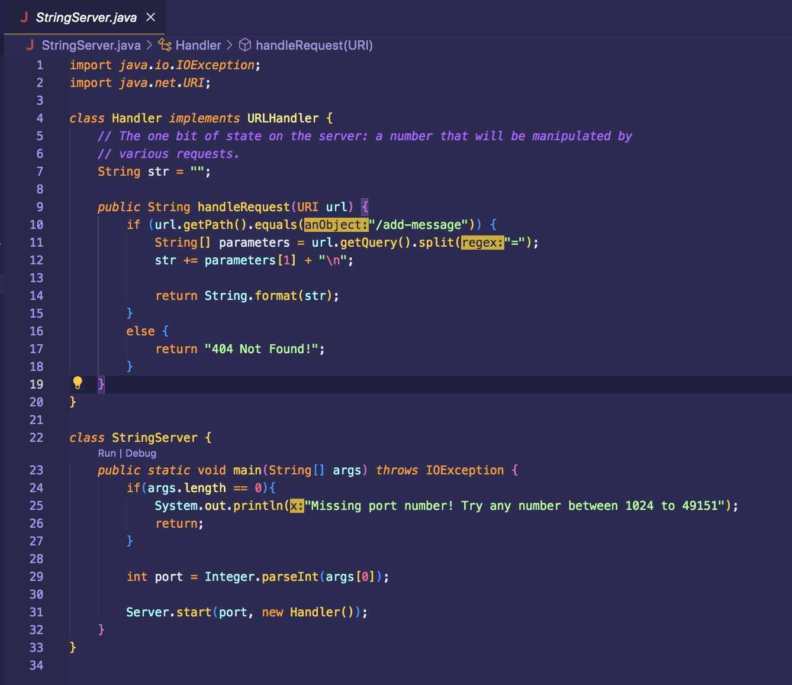
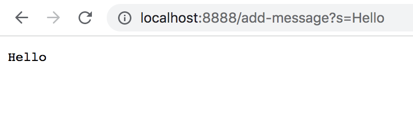
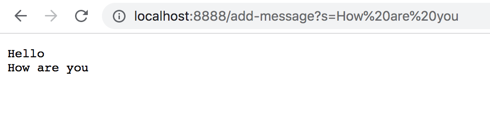
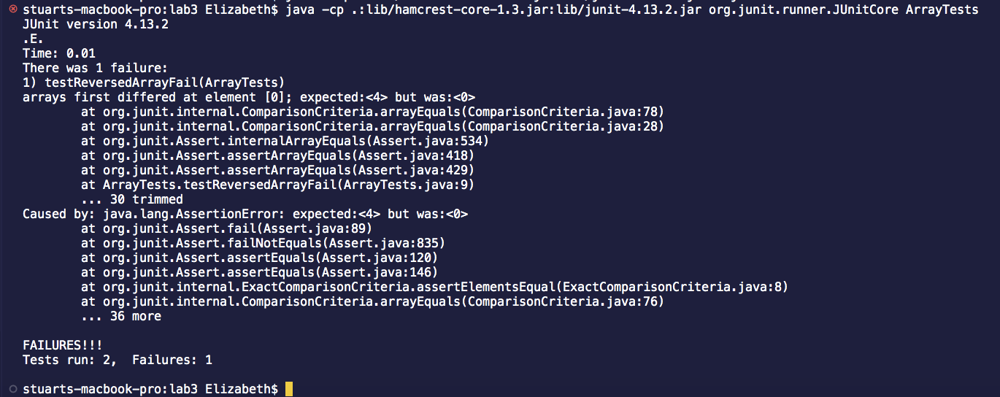

# Lab Report 1

## Part 1
*The code for StringServer:*


*Screenshots of ```/add-message```:* 

* The methods that are called are the handleRequest method in the **Handler** class and the main method in the **StringServer** class.
* The relevant argument for the handleRequest method is a url of type URI and the relevant argument for the main method is the port number. As for the values of any relevant fields, the **Handler** class has a field called **str** of type String, while the **StringServer** class doesn't have any relevant fields.
* The value of **str** changes from this specific request because it changes from an empty string "" to "Hello" and a new concatenated line. 


* The methods that are called are the handleRequest method in the **Handler** class and the main method in the **StringServer** class.
* The relevant argument for the handleRequest method is a url of type URI and the relevant argument for the main method is the port number. As for the values of any relevant fields, the **Handler** class has a field called **str** of type String, while the **StringServer** class doesn't have any relevant fields.
* The value of **str** changes from this specific request because it changes from "Hello" and a new concatenated line to "Hello", "How are you" in a new line, and a new concatenated line. 

## Part 2
*The buggy program is the **reversed method** in the ArrayExamples.java file.*
* A failure-inducing input for the buggy program:
```
  @Test
  public void testReversedArrayFail(){
    int[] input = {1, 2, 3, 4};
    int[] output = {4, 3, 2, 1};
    assertArrayEquals(output, ArrayExamples.reversed(input));
  }
```
* An input that doesn't induce a failure:
```
  @Test
  public void testReversedArrayPass(){
    int[] input = {0, 0, 0};
    int[] output = {0, 0, 0};
    assertArrayEquals(output, ArrayExamples.reversed(input));
  }
```
* The symptom as the output of running the tests:
 
* The bug as the before-and-after code change required to fix it:

before:
```
  static int[] reversed(int[] arr){
    int[] newArray = new int[arr.length];
    for (int i = 0; i  < arr.length; i += 1){
      arr[i] = newArray[arr.length - i - 1];
    }
    return arr;
  }
```
after:
```
  static int[] reversed(int[] arr){
    int[] newArray = new int[arr.length];
    for (int i = 0l i  < arr.length; i += 1){
      newArray[i] = arr[arr.length - i - 1];
    }
    return newArray;
  }
```

This fix addresses the issue by fixing the two bugs in the code. First, the code was bugged because we were trying to update the values in the **arr** array with the values in the array **NewArray**. However, since all of the values in **newArray** are 0, the values in the **arr** array were just being replaced with 0. To fix this bug, ```arr[i]``` in the third line of the method body had to be replaced with ```newArray[i]``` and ```newArray[arr.length - i - 1]``` had to be replaced with ```arr[arr.length - i - 1]```. The second bug in the code is that we were originally returning the **arr** array instead of returning the newly created and updated **newArray** array. So we were just returning an Array that has 0 for all of its values. To fix this bug, ```arr``` in the fifth line of the method body has to be replaced with ```newArray```.


## Part 3
Something that I learned from lab in week 2 was how to build and run a server on a local computer. It was cool to see how using the commands ```javac Server.java NumberServer.java``` and ```java NumberServer 4000``` (specifically for the files we used during lab) could start a server. Then by going to the url produced, you could see the output from methods in the NumberServer.java file. I also learned that in order to stop the server, you can press ```Crtl-C``` and that if you make a change to the server, you have to first stop the server and then restart it.
