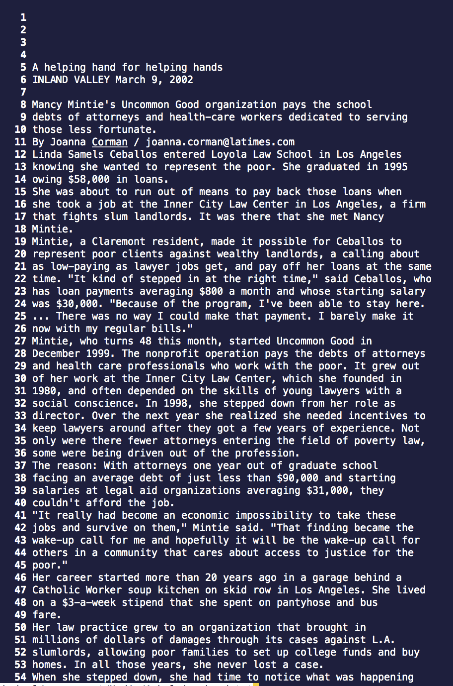
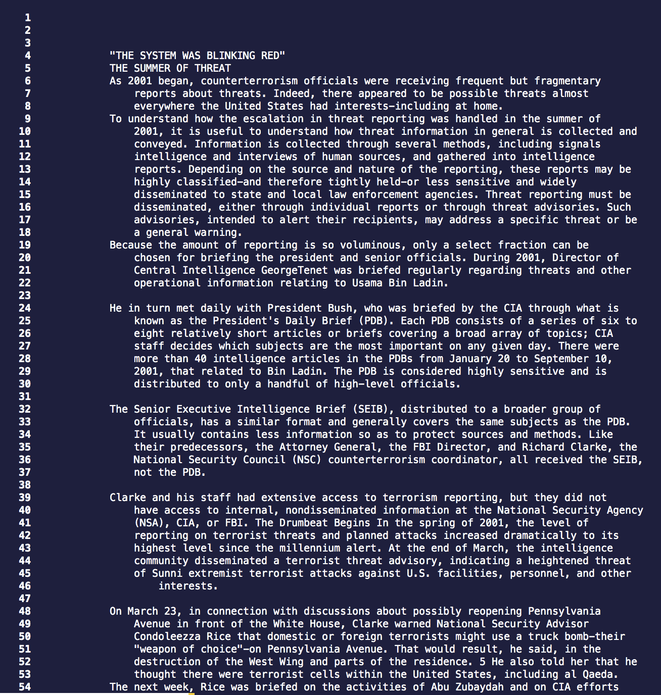
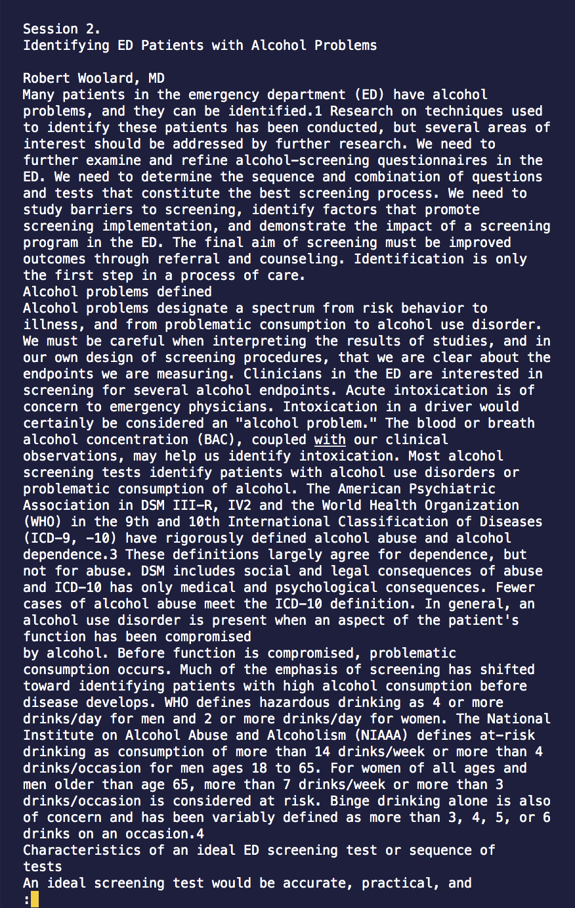
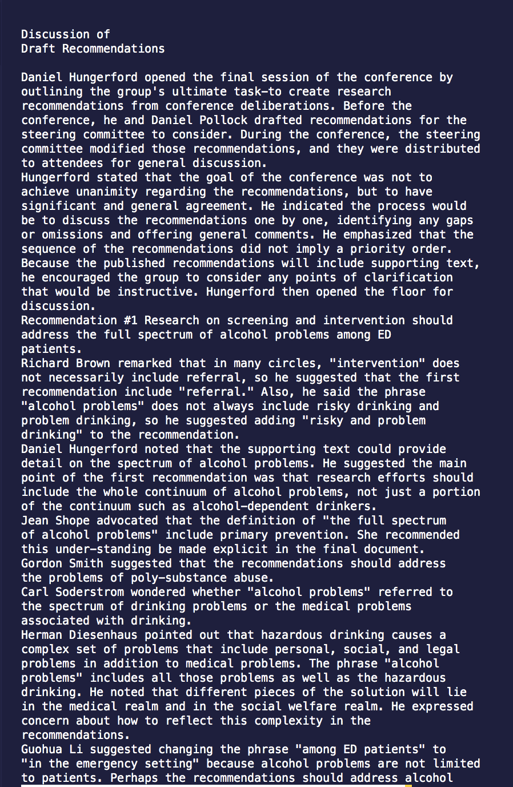
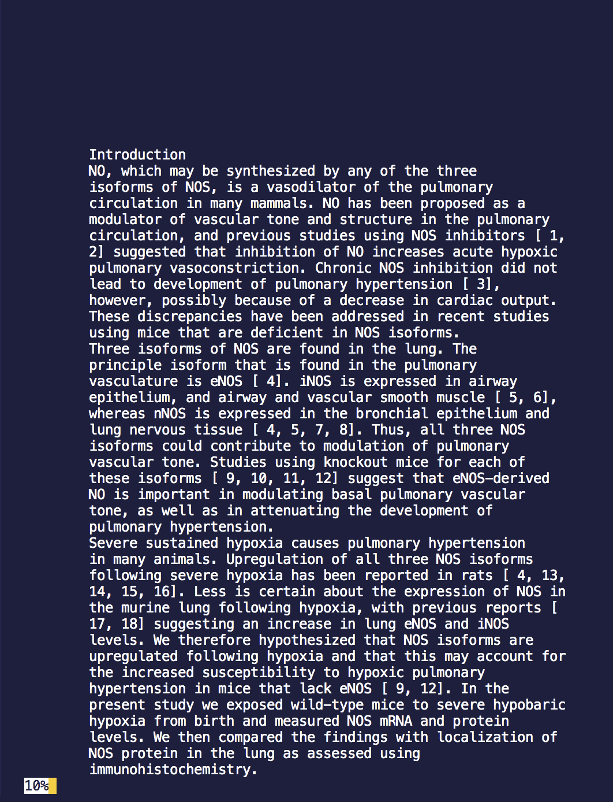
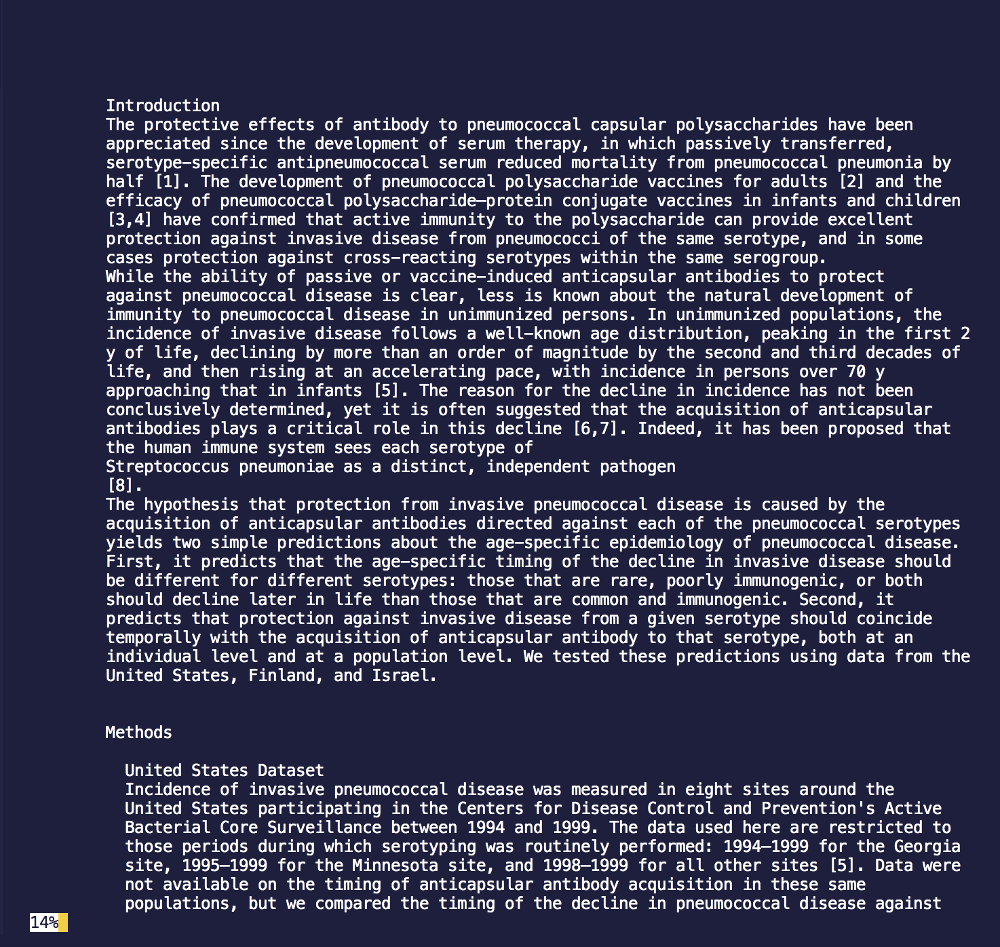
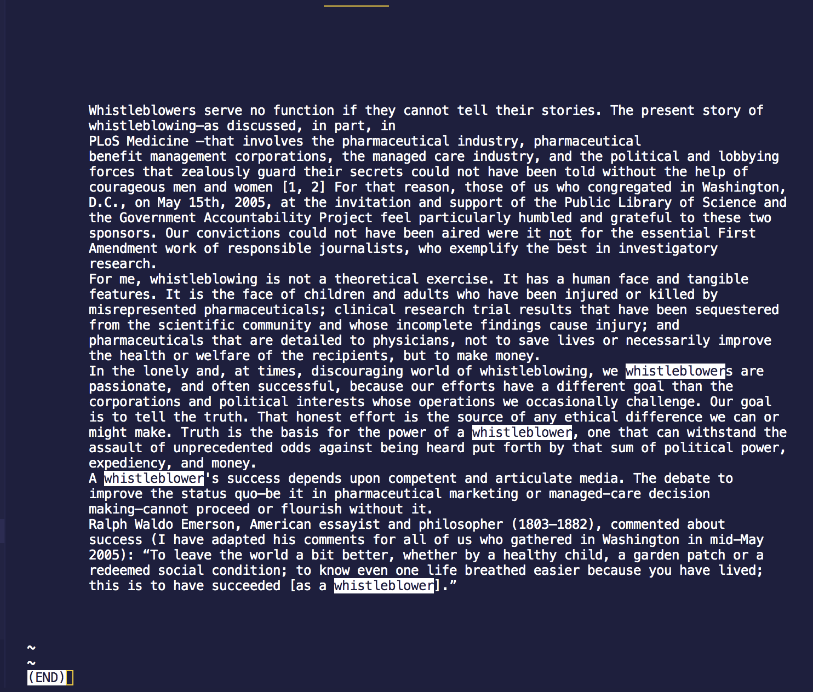
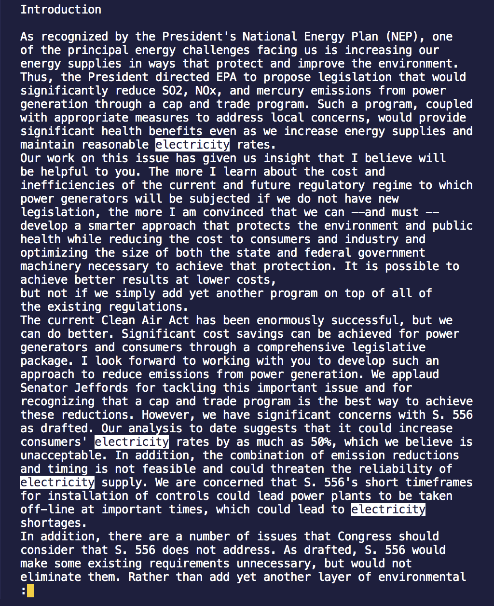

# Lab Report 3

## ```less -N```
**example1**:
  
command: ```less -N technical/government/Media/A_helping_hand.txt```
  
output: 



**example2**: 

command: ```less -N technical/911report/chapter-8.txt```

output:



**explanation**: ```less -N``` numbers each line in the file. For example, there will be a 1 next to the first line in the file, 2 next to the second line in the file, and so on. This is useful because it allows you to find a specific line quickly without having to skim through the whole file. An example of this could be if Person A and Person B are having a discussion about one of the .txt files and Person A wants Person B to look at line 159 of the file. Person A could then tell Person B to use ```less -N``` and Command+F "159" to easily find what line 159 says. 
  
**citation**: I found this command-line option by using the built in command ```man less```.
  

## ```less -s```
**example1**:
  
command: ```less -s technical/government/Alcohol_Problems/Session2-PDF.txt```
  
output: 
  


**example2**: 

command: ```less -s technical/government/Alcohol_Problems/DraftRecom-PDF.txt```

output:
  


**explanation**: ```less -s``` consolidates consecutive blank lines into a single blank line. This is useful because if a file has a lot of consecutive blank lines, you can combine them into just one blank line so that you don't have to scroll as much. 
  
**citation**: I found this command-line option by using the built in command ```man less```.
  

## ```less -m```
**example1**:
  
command: ```less -m technical/biomed/rr74.txt```
  
output: 
  


**example2**: 

command: ```less -m technical/plos/pmed.0020015.txt```

output:
  


**explanation**: ```less -m``` allows you to see what percent of the file you have looked at or in other words shows a percent of how far into the file you are. This is useful because it could help you determine how much of the file you have left to read.
  
**citation**: I found this command-line option by using the built in command ```man less```.


## ```less --pattern=pattern```
**example1**:
  
command: ```less --pattern=whistleblower technical/plos/pmed.0020281.txt```
  
output: 
  


**example2**: 

command: ```less --pattern=electricity technical/government/Env_Prot_Agen/nov1.txt```

output:
  


**explanation**: ```less --pattern=pattern``` highlights every occurrence of the word that you want to find. Whatever is after the = sign is the word that will be highlighted. This is useful because it allows you to see the occurences of whatever word you want to find at all once. For example, if you wanted to see if you use the word "electricity" a lot in a certain paragraph, you could use less ```--pattern=electricity``` to see how many times "electricity" is highlighted in that paragraph. 
  
**citation**: I found this command-line option by using the built in command ```man less```.
