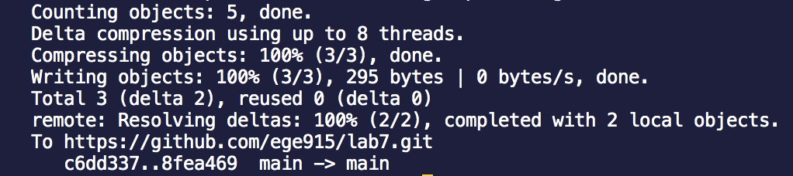

# Lab Report 4

## Step 4: Log into ieng6


Keys pressed: ```ssh cs15lsp23pi@ieng6.ucsd.edu``` < enter > 

I ssh-ed into the remote server with my course specific account and pressed enter to log in.

## Step 5: Clone your fork of the repository from your Github account
 

Keys pressed: ```git clone https://github.com/ege915/lab7.git``` < enter >

I used ```git clone``` to clone my fork of the repository and then pressed enter.

## Step 6: Run the tests, demonstrating that they fail


Keys pressed: ```cd lab7``` < enter > ```javac -cp .:lib/hamcrest-core-1.3.jar:lib/junit-4.13.2.jar *.java``` < enter > ```java -cp .:lib/hamcrest-core-1.3.jar:lib/junit-4.13.2.jar org.junit.runner.JUnitCore ArrayTests``` < enter >

I used ```cd lab7``` so that the current directory is lab7 and then pressed enter. Then I used ```javac -cp .:lib/hamcrest-core-1.3.jar:lib/junit-4.13.2.jar *.java``` and ```java -cp .:lib/hamcrest-core-1.3.jar:lib/junit-4.13.2.jar org.junit.runner.JUnitCore ArrayTests``` to run the tests.

## Step 7: Edit the code file to fix the failing test


Keys pressed: ```vim Li``` < tab > ```.java``` <enter> ```/while(index2``` < enter > ```jjjexi2```<esc> ```:wq``` < enter > 
  
I typed ```vim Li``` and then pressed tab so that the rest of ListExamples autofills. Then I typed .java and pressed enter to start editing the file. I used ```/while(index2``` to find a line near the line I wanted to edit. Then I pressed j 3 times to get down to the line I wanted to edit. Then I pressed e to get to the end of the word index1. Then I typed x to delete the 1 in index1 and then pressed i to go into insert mode. Then I typed 2 so that it says index2. I pressed esc to go back into normal mode and typed ```:wq``` to exit vim.

## Step 8: Run the tests, demonstrating that they now succeed


Keys pressed: ```bash t``` < tab > < enter >
  
I typed ```bash t``` and then pressed tab for the rest of test.sh to autofill. Then I pressed enter so that the tests would run. 

## Step 9: Commit and push the resulting change to your Github account (you can pick any commit message!)



Keys pressed: ```git init``` < enter > ```git add L``` < tab > ```.java``` < enter > ```git commit -m "edited files"``` < enter > ```git push origin main``` < enter >
  
I typed ```git init``` to reinitialize the repository. Then I typed ```git add L``` and pressed tab to autofill ListExamples. Then I typed ```.java``` and pressed enter to add ListExamples.java to the files that I want to be committed. Then I did ```git commit -m "edited files"``` to commit ListExamples.java. Finally, to push the changes I made to ListExamples.java to my Github account, I did ```git push origin main```.
  
