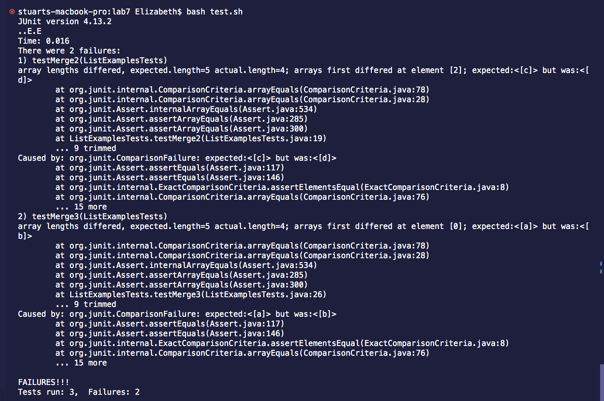
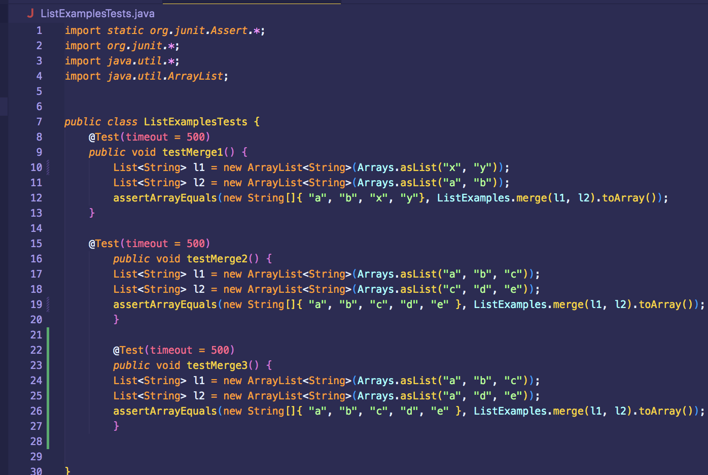
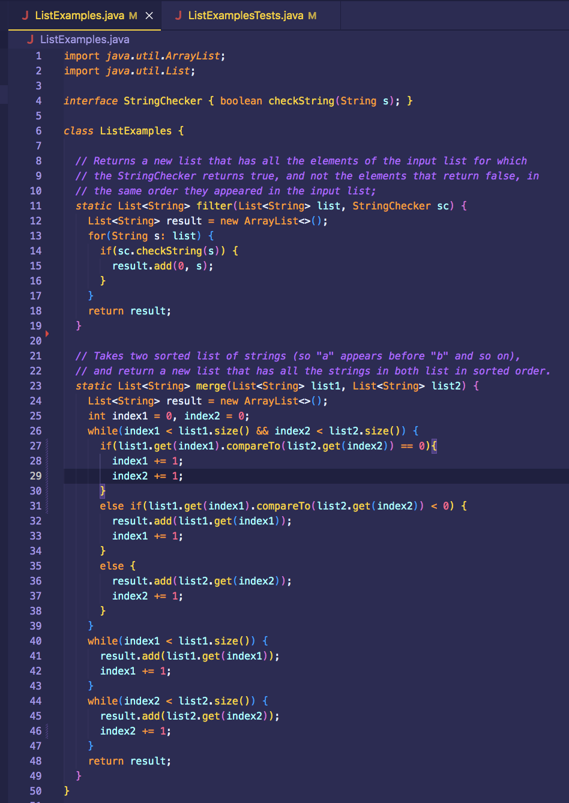
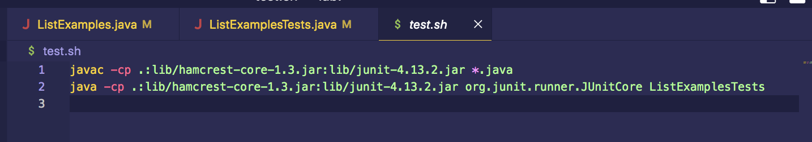
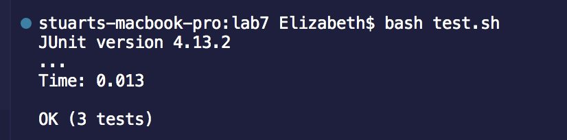
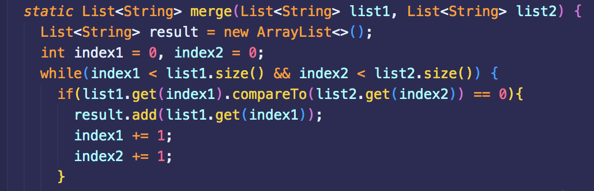

# Lab Report 5

## Part 1 - Debugging Scenario
> original post from student:

**What environment are you using (computer, operating system, web browser, terminal/editor, and so on)?**

I am operating on a MacBook Pro that has an operating system of MacOS and I am using the terminal in VSCode. 

**Detail the symptom you're seeing. Be specific; include both what you're seeing and what you expected to see instead. Screenshots are great, copy-pasted terminal output is also great. Avoid saying “it doesn't work”.**

Two of my tests are failing and the length of the expected array is different from the length of the actual array. In addition, the elements in the arrays are not entirely correct. In testMerge2, the expected array is { "a", "b", "c", "d", "e" }, but the actual array is { "a", "b", "d", "e" }. In testMerge3, the expected array is { "a", "b", "c", "d", "e" }, but the actual array is {"b", "c", "d", "e" }. These two tests have duplicates in them, so I think that might be the problem since none of the elements that were a duplicate appear in the final array. In this version of ListExamples.java, duplicate values are not supposed to all be added, but rather should only be added once.



**Detail the failure-inducing input and context. That might mean any or all of the command you're running, a test case, command-line arguments, working directory, even the last few commands you ran. Do your best to provide as much context as you can.**

The failure-inducing inputs are testMerge2 and testMerge3 in the ListExamplesTests.java file: 
This is my code in the ListExamples.java file: 
This is my code in the test.sh file: 
The only command that I am running is bash test.sh in order to run the tests. 


> response from a TA:

There seems to be an issue with the code in your ListExamples.java. Try going through the code in the merge method and see if you can find a bug somewhere there. It may be helpful to start looking at the part of the merge method that deals with duplicate values.


> student applying feedback and a clear description of what the bug is:

The bug was that if there were duplicates of a value, that value wouldn't be added to the array at all. Since both index1 and index2 were incremented by one, both instances of the duplicate value would be skipped and the code would move onto the next elements in each array. This bug resulted in arrays that were not the correct length and were missing elements. 

The terminal output after applying the TA's feedback.


> all information about the setup:
1) file and directory needed: 

The file that needs to be fixed is the ListExamples.java file. The tests are in the ListExamplesTests.java file and the test.sh file is used to run the tests. The directory needed is the lab7 directory because that is where all the files are. 

2) the contents of each file before fixing the bug:


3) the full command line you ran to trigger the bug:

```bash test.sh```

4) a description of what to edit to fix the bug:

To fix the bug, a line of code needs to be added within the if statement in the while loop and it should be added before the lines that say ```index1 += 1;``` and ```index2 += 1;```. The line of code should be ```result.add(list1.get(index1));```. This will fix the bug of the duplicate value not being added to the array at all. It should look like this: 

## Part 2 - Reflection 

Something that I learned from my lab experience in this second half of the quarter that I didn't know before was how to use vim. I had never heard of vim before and using the vimtutor to learn how to edit using vim was interesting as well. Using vim definitely helped me to speed up tasks from the command line, such as editing files and running tests. It was also interesting to see how different commands in vim can do similar things and how there are different combinations of commands that give you the same result but vary in speed/number of key presses. 
