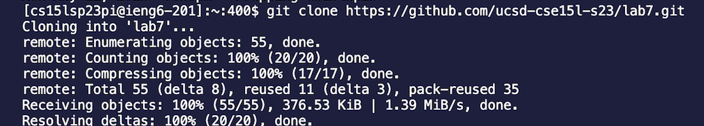

# Lab Report 4

## Step 4: Log into ieng6


Keys pressed: ```ssh cs15lsp23pi@ieng6.ucsd.edu``` < enter > 

I ssh-ed into the remote server with my course specific account and pressed enter to log in.

## Step 5: Clone your fork of the repository from your Github account
 

Keys pressed: ```git clone https://github.com/ege915/lab7.git``` < enter >

I used ```git clone``` to clone my fork of the repository and then pressed enter.

## Step 6: Run the tests, demonstrating that they fail
